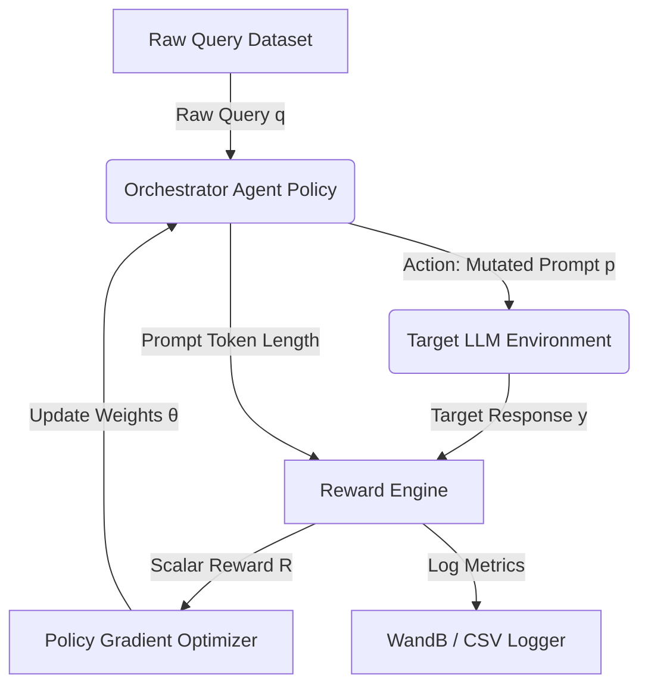

# Project Plan: RL-Based LLM Prompt Optimizer

This document contains the finalized project plan, architecture specifications, mathematical models, workload distribution, and milestone tracking for the **Autonomous LLM Prompt Orchestrator** project.

---

## 1. Problem Definition & Mathematical Formulation

Manual prompt engineering is labor-intensive, error-prone, and sub-optimal. The objective of this project is to train a smaller, local "Orchestrator" LLM (the **policy agent**, e.g., GPT-2, Qwen-1.5B) to act as a reinforcement learning agent that mutates raw user queries into highly optimized prompts. These prompts are evaluated by a "Target" LLM (the **environment**, e.g., LLaMA-3-8B via Groq API) to generate high-quality outputs while minimizing prompt token consumption.

### RL Formulation:
- **State Space (Observation) $S$**: The set of raw, unoptimized user queries. A state $s \in S$ is represented by the tokenized sequence of a messy query (e.g., *"convert name: david, contact: david@abc.com to json object"*).
- **Action Space $A$**: The tokenized vocabulary of the Orchestrator LLM. An action $a \in A$ is the generated sequence of the optimized prompt $p = [t_1, t_2, \dots, t_T]$ (e.g., *"Generate JSON object with 'user_id' and 'email' for David... "*).
- **Policy $\pi_\theta(p | q)$**: The probability of generating prompt $p$ given query $q$, parameterized by the Orchestrator's model weights $\theta$.
- **Environment $P(y | p)$**: The Target LLM. Given the action prompt $p$, it generates a text response $y$.
- **Reward Signal $R(y, p)$**: A scalar value in the range $[0.0, 1.0]$ representing output correctness and token efficiency:
  $$R(y, p) = \max\left(0, R_{\text{task}}(y) - \alpha \cdot \text{len}(p)\right)$$
  Where:
  - $R_{\text{task}}(y) \in [0.0, 1.0]$ measures target task accuracy (e.g., JSON schema validity).
  - $\text{len}(p)$ is the token count of the generated prompt.
  - $\alpha$ is the token penalty scale (e.g., $0.005$).

### Policy Gradient Optimization:
We optimize the policy weights $\theta$ using the REINFORCE algorithm with a moving average baseline $b$ to reduce variance. The policy loss is formulated as:
$$L(\theta) = - \frac{1}{N} \sum_{i=1}^{N} \left(R(y_i, p_i) - b\right) \log \pi_\theta(p_i | q_i)$$
Where:
- $N$ is the batch size.
- $b$ is the exponential moving average of historical rewards.

### Policy Decoding Strategy:
- **During Training (Exploration)**: The Orchestrator LLM uses sampled decoding (`do_sample=True`, temperature $0.7$) to explore the action space and generate diverse candidate prompts.
- **During Evaluation (Deterministic)**: The Orchestrator LLM uses greedy decoding (`do_sample=False`, temperature $0.0$) to select the highest-probability tokens deterministically. This ensures consistent, reproducible evaluation reports across all milestones.

---

## 2. System Architecture & Data Flow

The training pipeline operates in a closed loop:

1. **Input Batching**: Raw queries are loaded from `data/rl_dataset.json`.
2. **Action Generation**: The Orchestrator LLM samples tokens to construct the mutated prompt.
3. **Environment Execution**: The mutated prompt is forwarded to the Target LLM Client.
4. **Reward Calculation**: The output response is validated (e.g., JSON decoding + key presence) and penalized for prompt length.
5. **Optimization**: Backpropagation adjusts the Orchestrator's token emission weights to maximize future rewards.

---

## 3. Milestones & Timeline (Strict 2-Presentation Rubric)

### Milestone 1: Baseline & Pipeline Setup (Present 1 - Deadline: 16/6)
- **Objective**: Define metrics, establish data flow, and build the baseline model.
- **Deliverables**:
  - Target LLM API pipeline and rule-based Mock Target LLM.
  - SFT training script (`train_sft.py`) to bootstrap the Orchestrator.
  - Automatic WandB initialization and local CSV logging fallback.
  - Demonstration of raw vs. SFT prompt generation metrics.
- **Methodology**: Supervised Fine-Tuning (SFT) on `data/sft_dataset.json`.

### Milestone 2: Policy Optimization & Evaluation (Present 2 - Deadline: 14/7)
- **Objective**: Implement reinforcement learning to optimize prompt formatting and token efficiency.
- **Deliverables**:
  - RL training loop (`train_rl.py`) running policy gradient optimization.
  - Evaluation reporting script (`evaluate.py`) comparing Raw vs. SFT vs. RL.
  - WandB report showcasing learning curves (loss, mean reward, and average prompt length decreasing).
  - Live execution demo of RL agent successfully optimizing edge-case user queries.
- **Methodology**: REINFORCE Policy Gradient.

---

## 4. Student Work Distribution (3 Collaborators)

To coordinate parallel work, assignments are mapped directly to project components:

| Role / Partner | Key Responsibilities | Assigned Files |
| :--- | :--- | :--- |
| **Partner A** (Infrastructure & Data) | - API client implementation (Groq, OpenAI) - Dataset preparation, formatting, and loading - Data pipeline performance & asynchronous calling | `src/target_llm.py` `data/make_dataset.py` `data/` directory |
| **Partner B** (RL Modeling) | - Orchestrator configuration & Hugging Face wrappers - SFT baseline pipeline development - RL REINFORCE training loop & gradient updates | `src/agent.py` `train_sft.py` `train_rl.py` |
| **Partner C** (MLOps & Rewards) | - Reward function engine (JSON, token penalties) - Logging configurations (WandB & CSV fallbacks) - Evaluation comparative suite and reporting | `src/reward.py` `src/utils.py` `evaluate.py` |
